# System Diagrams

This file contains logical diagrams for the current and target MandiBook system.

## 1. High-Level Class Diagram

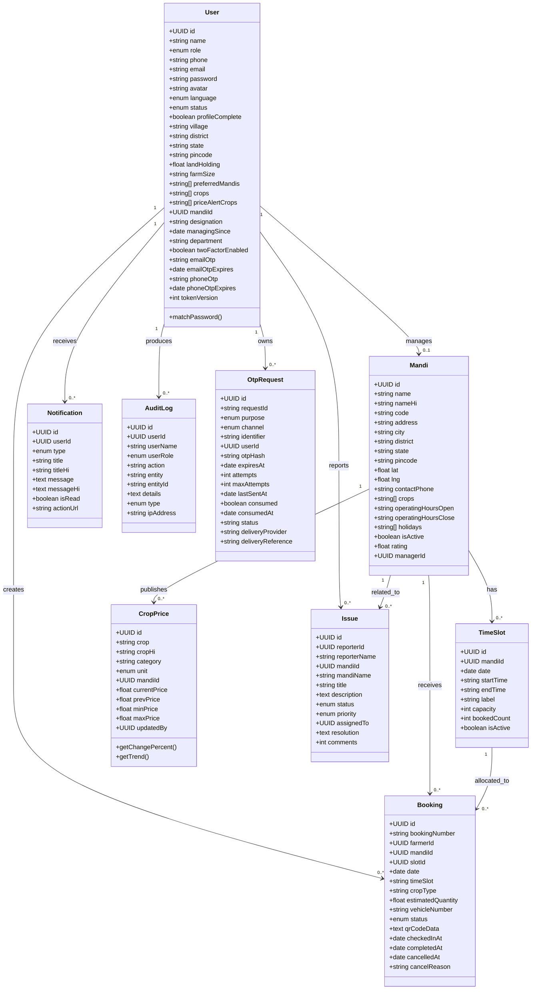

## 2. Use Case Diagram

```mermaid
flowchart LR
    Farmer[Farmer]
    Manager[Manager]
    Admin[Admin]

    UC1((Login with Phone OTP))
    UC2((Login with Email OTP))
    UC3((Complete Profile))
    UC4((Browse Mandis))
    UC5((Find Nearby Mandis))
    UC6((Book Slot))
    UC7((View QR Booking))
    UC8((Cancel Booking))
    UC9((View Prices))
    UC10((Manage Preferences))
    UC11((View Notifications))
    UC12((Report Issue))

    UC13((Manager Login))
    UC14((View Dashboard))
    UC15((Manage Bookings))
    UC16((Check In Farmer))
    UC17((Complete Booking))
    UC18((Manage Slots))
    UC19((Update Prices))
    UC20((Send Broadcast))
    UC21((View Reports))
    UC22((Resolve Issues))

    UC23((Admin Login + 2FA))
    UC24((View Platform Dashboard))
    UC25((Manage Mandis))
    UC26((Manage Users))
    UC27((View Analytics))
    UC28((Compare Prices))
    UC29((Broadcast Notifications))
    UC30((Oversee Issues))
    UC31((Download Reports))
    UC32((View Audit Logs))

    Farmer --> UC1
    Farmer --> UC2
    Farmer --> UC3
    Farmer --> UC4
    Farmer --> UC5
    Farmer --> UC6
    Farmer --> UC7
    Farmer --> UC8
    Farmer --> UC9
    Farmer --> UC10
    Farmer --> UC11
    Farmer --> UC12

    Manager --> UC13
    Manager --> UC14
    Manager --> UC15
    Manager --> UC16
    Manager --> UC17
    Manager --> UC18
    Manager --> UC19
    Manager --> UC20
    Manager --> UC21
    Manager --> UC22

    Admin --> UC23
    Admin --> UC24
    Admin --> UC25
    Admin --> UC26
    Admin --> UC27
    Admin --> UC28
    Admin --> UC29
    Admin --> UC30
    Admin --> UC31
    Admin --> UC32
```

## 3. Sequence Diagram - Farmer Email OTP Login (Target Design)

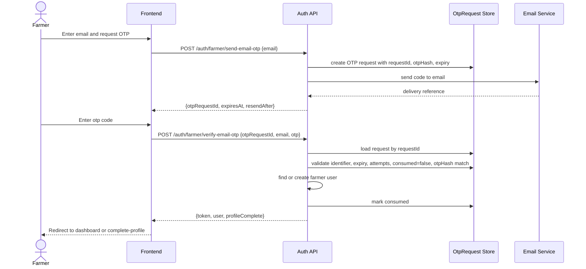

## 4. Sequence Diagram - Farmer Slot Booking

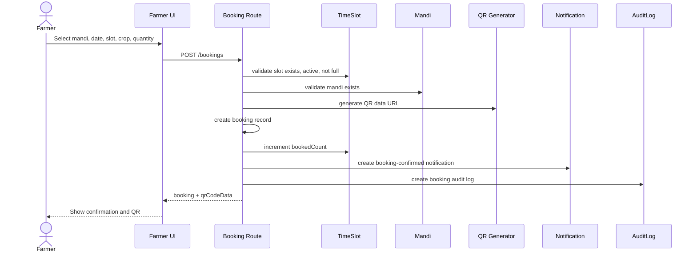

## 5. Sequence Diagram - Manager Check-In

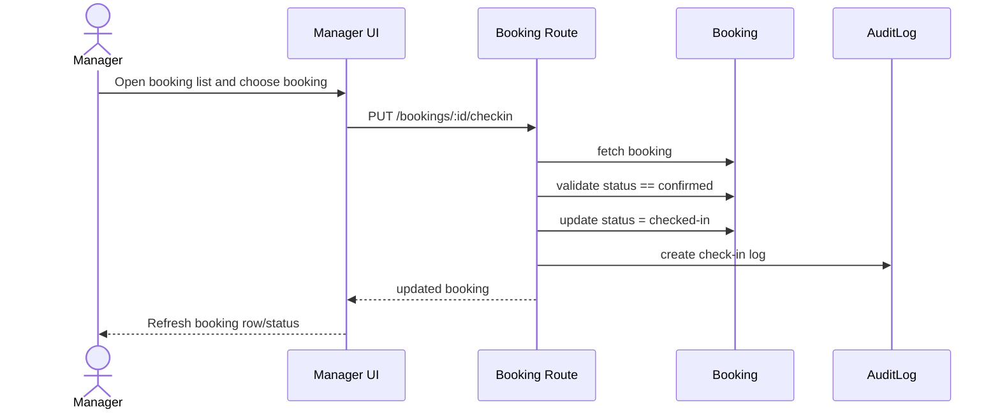

## 6. Sequence Diagram - Admin Create Manager

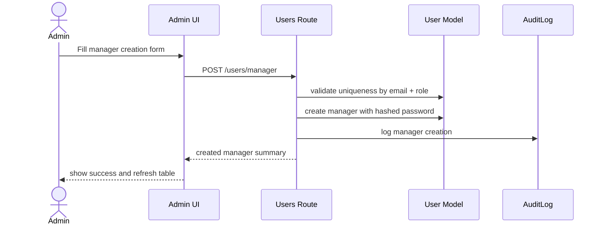

## 7. Activity Diagram - Farmer Login and Onboarding

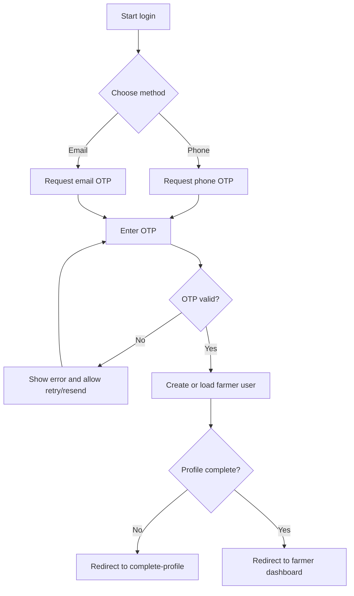

## 8. Activity Diagram - Booking Lifecycle

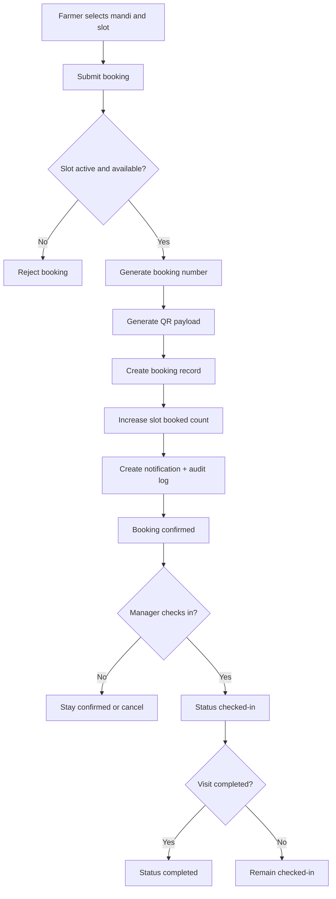

## 9. Activity Diagram - Issue Resolution Flow

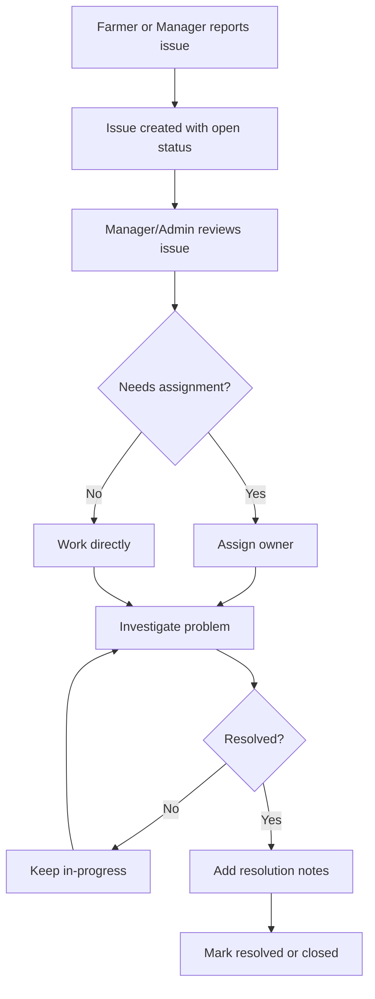

## 10. State Diagram - Booking

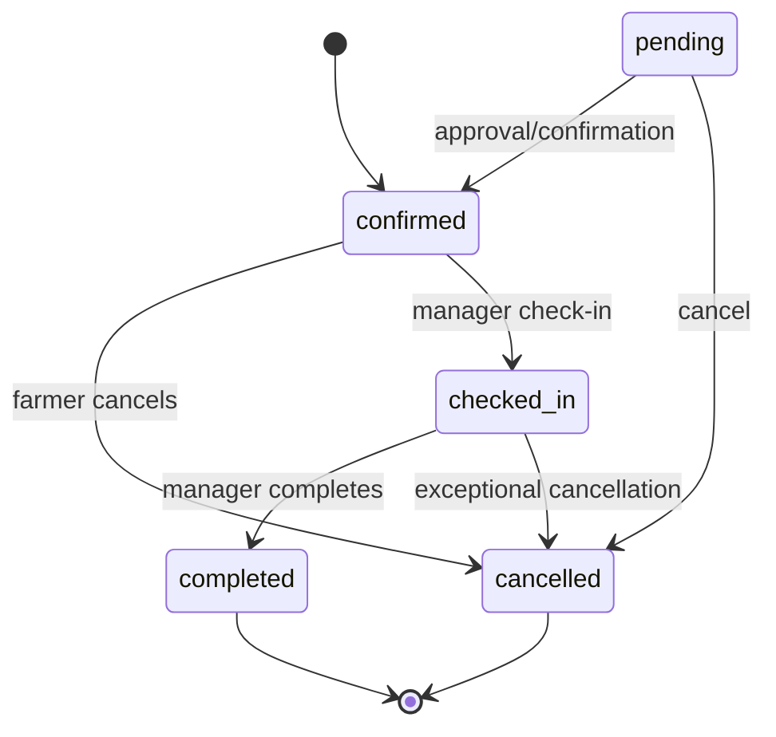

## 11. State Diagram - Issue

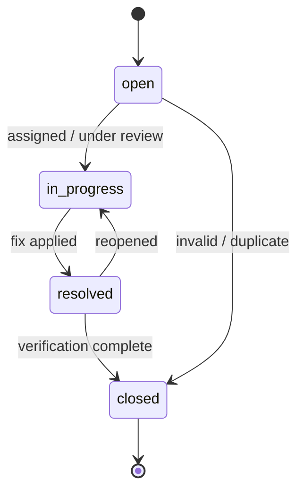

## 12. State Diagram - OTP Request (Target)

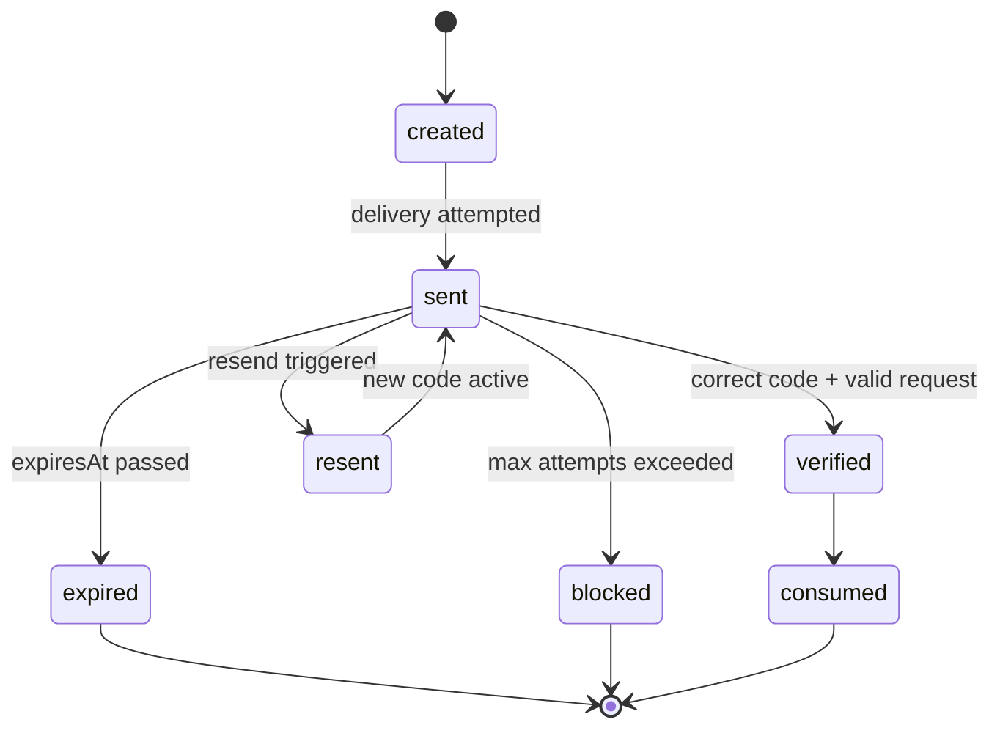

## 13. Class Diagram Notes

### Current vs Target

The class diagram includes `OtpRequest` even though it is not yet implemented in the current backend, because:

- it is required to solve the email OTP reliability issue
- it cleanly separates verification sessions from user records
- it supports both farmer email login and admin second-factor verification

### Why `OtpRequest` matters

Without `OtpRequest`, the current design causes:

- overwritten OTP state on repeated sends
- no request/session binding
- weak auditability
- hard-to-debug invalid OTP incidents
- shared risk between farmer email login and admin 2FA

## 14. Diagram Usage Recommendation

Use these diagrams as the baseline for:

- software engineering documentation
- implementation planning
- Viva / presentation material
- PRD to engineering translation
- backend refactoring guidance

These diagrams represent the intended product architecture more accurately than the current mock-heavy frontend state.
